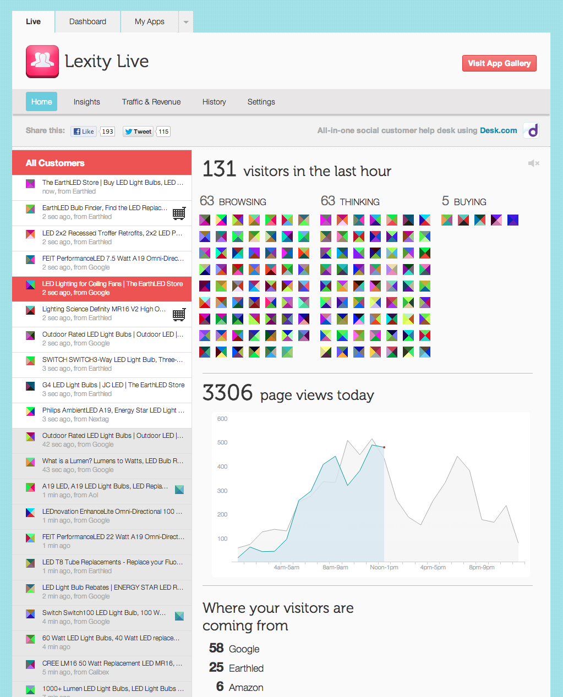

Lexity Live is a free real-time visitor tracking tool for online stores that lets you see who is in your store NOW, what pages they are viewing, which products they are putting in the shopping cart, and more.

##Features

###Monitor your customer activity in real time

Lexity Live is a free website traffic analysis tool designed for ecommerce, with real time visitor tracking and much more. Other tools like Google Analytics can take hours to process data, too late for you to react. With Lexity Live, real time information about current site visitors lets you watch your customers browse your website and go from checkout to purchase, all as it happens.

###Initiate chats with customers

Increase your conversions and customer satisfaction. With one click, start chatting with any visitor on your site instantly.

###Get smart, actionable marketing insights

Find out your top keywords, top referring sites, and more at a glance with Lexity Live Insights. Lexity Live Insights automatically analyzes your store visit data and summarizes it into clear, simple takeaways so you get smart and actionable marketing recommendations.

###See your traffic and revenue split out by channel

Finally, find out where your sales are really coming from, with Lexity Live Traffic and Revenue. See which of your marketing efforts are giving you the best return on investment, with charts that show your traffic and revenue by channel.

###View your store’s historical trends

Understand your traffic and revenue trends over time, your top customers by sales and geographical location, and your store’s growth and seasonality.

##What Our Customers Say

"Lexity Live has that fascination factor. You get this connection to your customer when you can see someone come in and look around, right when they're doing it…I keep Lexity Live open in a tab all the time and check it half a dozen times a day…My daughter says I'm addicted. I think she's right." — Cheryl Rowland, Creative Merchandise Store

"It's convenient and easy to use; in other analytics tools you have to click through multiple pages to get the same thing." — Del DeJean, www.NaturalTarot.com

"I just can't stop looking at Lexity Live. Maybe it's an obsessive compulsive thing. If it's not already on in the morning, it's the first thing I turn on when I get out of bed." — Guy Martin Smalley, MacModify

##Learn More

Learn more at cloudflare.lexity.com, where you can also chat with us live, contact us at support@lexity.com, or call us toll free at 1-855-533-8144. Follow @Lxty on Twitter and Like us on Facebook for updates.